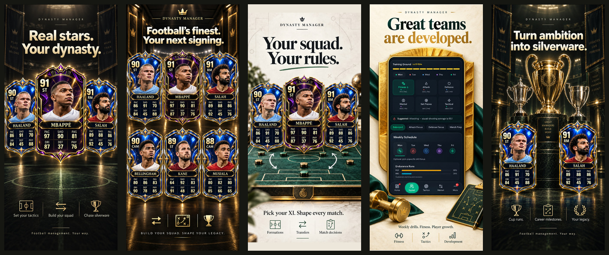

# Dynasty Manager: five-screen campaign

Five distinct promotional compositions, each exported in three portrait sizes.
Upload the numbered JPEGs in order, from the folder matching the device slot.

| Folder | Pixels | Count |
| --- | --- | --- |
| iphone-6.5 | 1242 × 2688 | 5 |
| iphone-6.9 | 1320 × 2868 | 5 |
| ipad-13 | 2064 × 2752 | 5 |

1. **Real stars. Your dynasty.** Three-player lead image.
2. **Football's finest. Your next signing.** Six-player roster showcase.
3. **Your squad. Your rules.** Tactics and squad building.
4. **Great teams are developed.** Training and development.
5. **Turn ambition into silverware.** Cup runs and career progression.

## Production notes

- All exports are opaque sRGB JPEGs. Names, ratings, and displayed stats were checked against the current roster and PlayerCard display order.
- No active player uses the ivory Icon background in this set, per the owner's direction. This is a marketing-art choice, not a change to the game's current tier-to-frame mapping.
- These are generated promotional compositions, not native captures. Player portraits, trophy-room scenery, and tabletop tactics imagery are promotional artwork. The training image is generated from an existing game capture, not pixel-identical to that capture.
- Base roster ratings are shown with decorative frame selections. These must not be presented as guarantees of specific paid-pack editions, whose boosts vary.
- Native source artwork is roughly 850 pixels wide. Exporting to larger dimensions does not create native device-resolution detail.
- iPad exports preserve the complete portrait artwork with matching side margins. They are resized promotional layouts, not evidence of the app's iPad interface.
- No App Store upload or App Review submission is performed by this PR. Final store suitability needs review against the shipping app.

## Re-export

Run `node marketing/appstore-2026-09/export.mjs` from the repository. Requires ImageMagick's `convert` and `identify` commands, with no additional npm dependencies. The five high-quality JPEG masters are included. Exports use proportional Lanczos resizing and matching canvas extension, never stretching or content cropping. `manifest.json` records all 15 exact dimensions.

Apple's accepted portrait sizes were checked on 2026-09-08: [Screenshot specifications](https://developer.apple.com/help/app-store-connect/reference/app-information/screenshot-specifications).

## Generation direction

Built-in image generation used the approved campaign images and repository card artwork as references. The prompt set required charcoal/emerald/gold or ivory/emerald styling, distinct gameplay themes, recognizable roster players, fitted portraits, top-left overall and position, and a PAC/SHO/PAS then DRI/DEF/PHY grid. The game currently displays its mental attribute under DRI, so the campaign follows that display rather than inventing a separate dribbling statistic.
